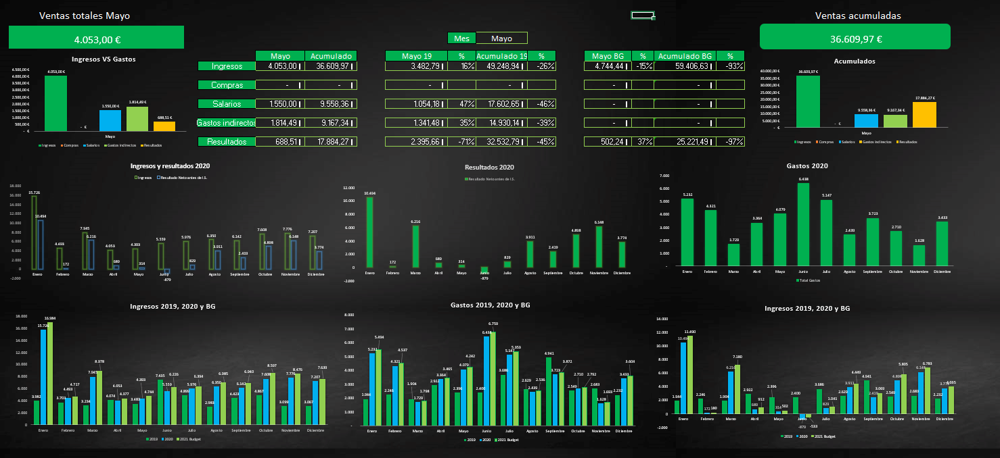
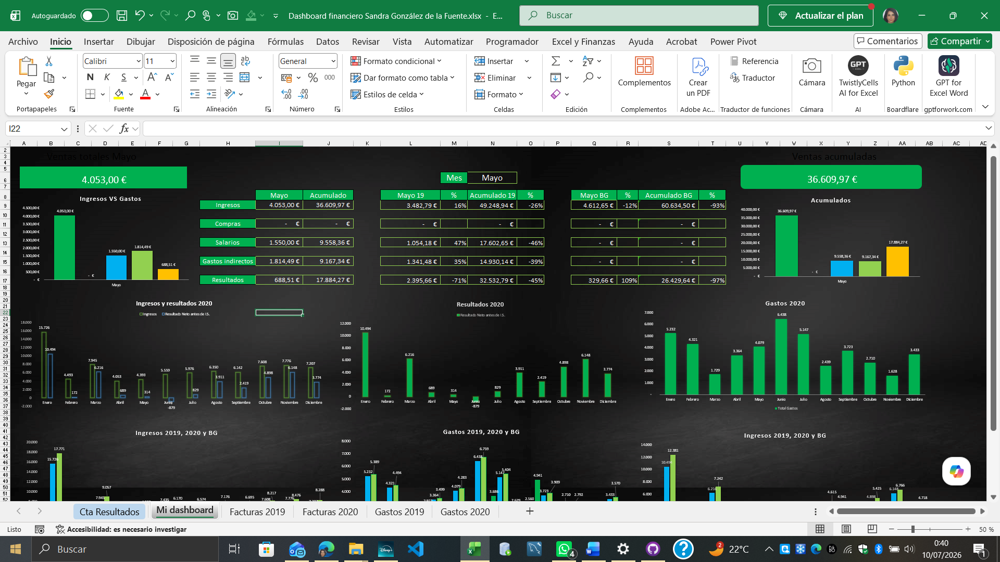
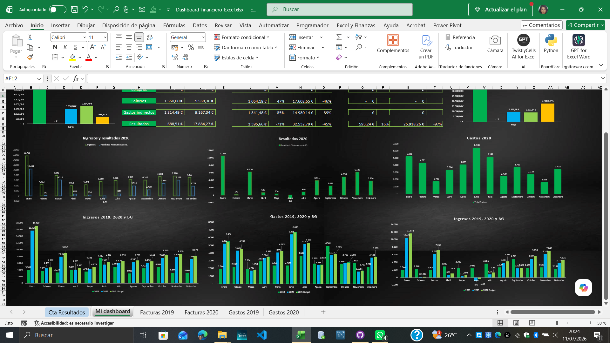

# Dashboard-financiero-Excel

## Descripción

Este proyecto consiste en el desarrollo de un Dashboard financierto en Microsot Excel para el análisis de una cuenta de resultados.

El proyecto incluye la elaboración de la cuenta de resultados a partir de los datos facilitados, la organización de la información y el diseño de un dashboard que permite visualizar los principales indicadores de forma rápida e intuitiva.

## Herramientas utilizadas

- Microsoft Excel
- Fórmulas de Excel
- Tablas
- Gráficos

## Contenido

- Elaboración de la cuenta de resultados.
- Desarrollo del dashboard financiero.
- Visualización de la información mediante gráficos e indicadores.

## Capturas

### Dashboard completo

Vista general del dashboard financiero desarrollado en Excel para el análisis de una cuenta de resultados. Debido al tamaño del dashboard, a continuación se muestran cpturas ampliadas de cada una de sus secciones.

### Parte 1 del dashboard

En esta sección se muestran las tablas de información financiera, los gráficos de Ingresos vs Resultados del ejercicio 2020, los datos acumulados de 2020 y el desglose correspondiente a dicho año.

### Parte 2 del dashboard

En esta sección se presenta una comparativa de los principales indicadores financieros, facilitando el análisis y la interpretación de los resultados.

